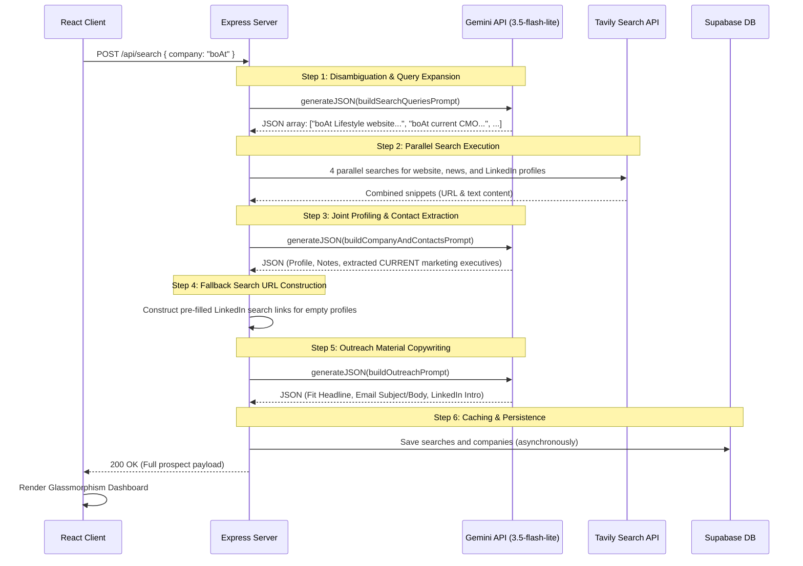

# Search & AI Processing Pipeline

This document explains the technical sequence, data structures, and pipeline flow that executes whenever a prospecting query is submitted.

---

## 1. Pipeline Architecture Diagram

---

## 2. Step-by-Step Data Flow

### Step 1: Query Disambiguation (Gemini)
* **Goal:** Expand generic names into specific search terms.
* **Input:** Raw search string (e.g. `"boAt"`).
* **Prompt:** `buildSearchQueriesPrompt`
* **Output:** Exact 4-query string array (e.g. `["boAt Lifestyle website...", "boAt Lifestyle current CMO...", ...]`).

### Step 2: Web Signal Ingestion (Tavily)
* **Goal:** Fetch real-time web context.
* **Execution:** Parallel HTTP `POST` requests to Tavily Search API.
* **Format:** Mapped into `SourceRecord` objects containing both the `URL` and the text `Content` so that Gemini can read profile links.

### Step 3: Company Profiling & Contact Extraction (Gemini)
* **Goal:** Extract structured data for the company and its active leadership.
* **Prompt:** `buildCompanyAndContactsPrompt`
* **Output:** JSON object containing:
  * Company profile details (summary, website, recent launches, custom notes).
  * Array of key contacts currently working at the company, specifically focused on CMOs, Brand leads, and marketing partnership directors.

### Step 4: Contact Link Refinement (Backend Server)
* **Goal:** Ensure all LinkedIn buttons are functional.
* **Logic:** If the search snippet did not yield a direct profile URL for a contact, the server constructs a pre-targeted LinkedIn search query link:
  `https://www.linkedin.com/search/results/people/?keywords=${encodeURIComponent(Name + ' ' + Company)}`

### Step 5: Copywriting Outreach Drafts (Gemini)
* **Goal:** Draft personalized emails and LinkedIn intro messages.
* **Prompt:** `buildOutreachPrompt`
* **Output:** JSON object containing email subject/body, LinkedIn connection text (under 300 characters), and an AI fit confidence score.

### Step 6: Logging & Delivery
* **Goal:** Store history and return results.
* **Logic:** Saves queries and profiles asynchronously to Supabase.
* **Response:** Returns the structured data payload to the client.
